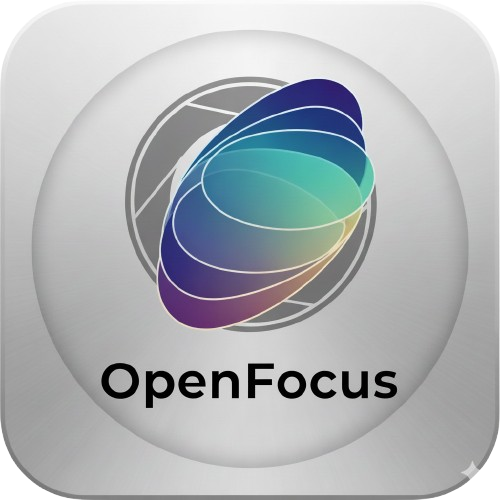
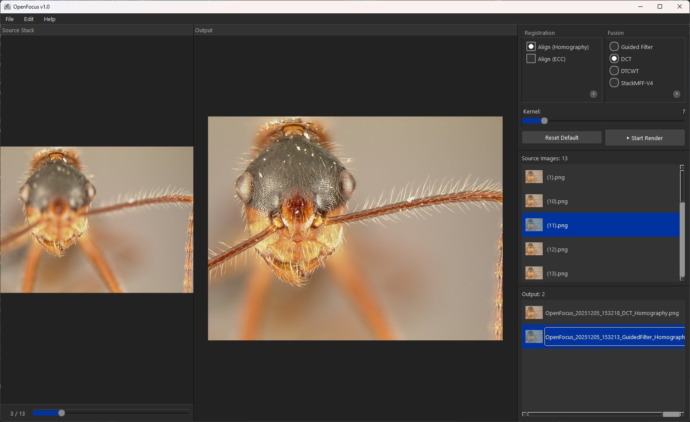

# <span style="display:flex; align-items:center; gap:16px;"> OpenFocus</span>

OpenFocus is all you need.

<p align="left">
	<a href="https://www.python.org/downloads/release/python-3100/"></a>
	<a href="./LICENSE"></a>
	<a href="https://github.com/your-org/OpenFocus"></a>
</p>

<h2 id="environment-setup">⚙️ Environment Setup</h2>
```bash
conda create -n openfocus python=3.10
conda activate openfocus

# Core runtime dependencies
pip install opencv-python pyqt6 numpy

# Fusion/registration extras
pip install torch torchvision
pip install dtcwt
```

> **Note:** The StackMFF V4 neural fusion benefits from GPU-capable PyTorch builds, but CPU-only installs also work (slower). Install the appropriate `torch` wheels from [pytorch.org](https://pytorch.org/) if you need CUDA support.

## Table of Contents
- [⚙️ Environment Setup](#environment-setup)
- [🔭 Overview](#overview)
- [✨ Highlights](#highlights)
- [🧪 Fusion & Registration Methods](#fusion--registration-methods)
- [📚 References](#references)
- [🤝 Contribution](#contribution)
- [📄 License](#license)

<h2 id="overview">🔭 Overview</h2>
OpenFocus is a PyQt6-based multi-focus registration and fusion workstation that delivers commercial-grade alignment and blending results. The project is fully open source (MIT License) and runs on CPU by default with optional GPU acceleration for the StackMFF V4 neural model.

<p align="center">
	
</p>

<h2 id="highlights">✨ Highlights</h2>
- **Beginner-Friendly**: Plug-and-play workflows with unapologetically simple, guided operations.
- **Flexible Processing Flows**: Run fusion-only, registration-only, or combined registration + fusion pipelines depending on your workload.
- **Batch Automation**: Kick off batch jobs across multiple folders with live progress, cancellation, and automatic output organization.
- **Annotation & Export Toolkit**: Overlay labels, export GIF animations, and save processed stacks in JPG/PNG/BMP/TIFF with consistent metadata handling.
- **AI-Assisted Fusion**: Ship with StackMFF V4 to unlock deep-learning-quality fusion alongside classic signal-processing methods.

<h2 id="fusion--registration-methods">🧪 Fusion & Registration Methods</h2>
Mix and match the built-in algorithms to suit your data:
- **Guided Filter**: Fast edge-preserving fusion that enhances contrast while suppressing noise.
- **DCT Multi-Focus Fusion**: Frequency-domain technique optimized for crisp detail recovery.
- **Dual-Tree Complex Wavelet Transform (DTCWT)**: Multi-scale representation that preserves fine texture structures.
- **StackMFF V4 Neural Model**: Pretrained deep model delivering state-of-the-art focus stacking quality.
- **Hybrid Registration**: Homography, ECC, or combined strategies ensure robust alignment across challenging captures.

<h2 id="references">📚 References</h2>
- M. B. A. Haghighat, A. Aghagolzadeh, and H. Seyedarabi, "Multi-focus image fusion for visual sensor networks in DCT domain," *Computers & Electrical Engineering*, vol. 37, no. 5, pp. 789-797, 2011.
- J. J. Lewis, R. J. O'Callaghan, S. G. Nikolov, D. R. Bull, and N. Canagarajah, "Pixel- and region-based image fusion with complex wavelets," *Information Fusion*, vol. 8, no. 2, pp. 119-130, 2007.
- S. Li, X. Kang, and J. Hu, "Image fusion with guided filtering," *IEEE Transactions on Image Processing*, vol. 22, no. 7, pp. 2864-2875, 2013.

<h2 id="contribution">🤝 Contribution</h2>
We welcome community contributions of all kinds:
1. **Issues**: Report bugs, request features, or propose UX enhancements.
2. **Algorithm & Performance Work**: Share new fusion/registration ideas, optimizations, or benchmark results.

Please open an issue to discuss significant changes before submitting pull requests and include validation steps with your patches.

<h2 id="license">📄 License</h2>
This project is released under the [MIT License](./LICENSE). Feel free to use, modify, and distribute within the terms of the license.

<p align="center" style="font-size:1.25rem; font-weight:600;">
	If OpenFocus helps you, please consider leaving a ⭐ on the repository!
</p>
