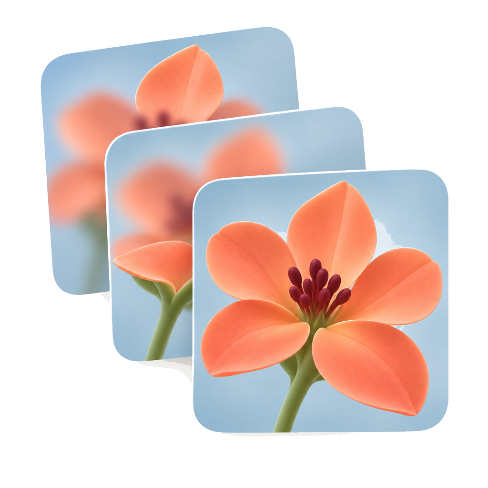
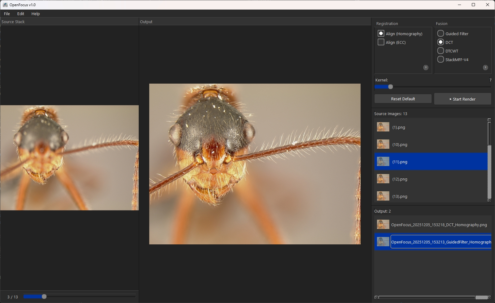

#  OpenFocus

OpenFocus delivers focus stacking quality that rivals commercial-grade software, while staying fully open source and easy to extend.

<p align="left">
  <a href="https://www.python.org/downloads/release/python-3100/"></a>
  <a href="./LICENSE"></a>
  <a href="https://github.com/Xinzhe99/OpenFocus"></a>
  <a href="https://github.com/Xinzhe99/OpenFocus/releases"></a>
</p>

## 📢 News

> [!NOTE]
> 🎉 **2026.09.22 (4)**: **v1.15** — the deep-learning method is now simply **"AI"** in the interface and help pages, releases now ship a **Windows installer** (setup.exe with shortcuts and uninstaller) and a **macOS DMG** alongside the portable packages, and the app has a **new icon**.

> 🎉 **2026.09.22 (3)**: **v1.14** — pure speed and control, zero changes to results: **renders are cancellable** (click the render button mid-run), **stack loading happens in the background** (the window no longer freezes on big stacks), display pixmaps render lazily (faster loads, hundreds of MB less memory on large stacks), and startup is ~1.4 s faster now that torch imports only when you actually use StackMFF-V4.

> 🎉 **2026.09.22 (2)**: **v1.13** — a review round over the 16-bit pipeline and registration cache fixed 15 issues, including corrupted wipe-view output for 16-bit stacks, silent 16-bit truncation in the CuPy registration path, stale disk-cache hits after rotate/flip/resize, near-invisible label colours on 16-bit frames and a broken daily update-check rate limit.

> 🎉 **2026.09.22**: **v1.12** — **16-bit PNG/TIFF inputs are now preserved end-to-end** (fuse at full depth, export back at 16 bits), **registration results are cached on disk** so re-opening a stack skips alignment, the CLI gained **batch mode** (`--output-dir`), plus window-layout memory, EXIF orientation correction, a selectable drag-out export format, and a daily automatic update check. Also shipped: a pytest test suite running on CI for every push.

> 🎉 **2026.09.21 (4)**: **v1.11** — **Quick preview** renders a fast downscaled draft for parameter tuning, **Help → Check for Updates** tells you when a new release is out, delete actions now ask for confirmation, and OpenFocus finally writes **log files** (Help → Open Logs Folder). Plus: a proper **pytest test suite** running on CI for every push, and more reliable ECC on small-shift stacks.

> 🎉 **2026.09.21 (3)**: New **Wipe compare** view — after rendering, press "Wipe" in the result panel title bar to compare the fusion result against any source frame (or two outputs against each other) in one frame with a draggable divider, shared zoom and pan. Side A can follow the source slider or lock to any frame; side B shows the latest render or scrubs the output history — both via sliders that scale to large stacks. Performance: **ECC registration now computes frame pairs in parallel** (~1.5x+ faster, scales with frame count), the app **starts faster** (torch probe moved off the UI thread, UPX disabled in release builds). Settings, language, GPU toggle and recent files persist across sessions, and OpenFocus runs **headless from the command line** — see [Command Line Usage](#command-line-usage).

> 🎉 **2026.09.21**: **v1.9 released** — now with ready-to-run builds for both **Windows and macOS (Apple Silicon)** on the [Releases](https://github.com/Xinzhe99/OpenFocus/releases) page. This version fixes 9 bugs (batch processing NameError, JPG quality setting ignored, UI controls staying disabled after a render error, a crash when closing during processing, the StackMFF-V4 "NoneType" error in the packaged build, and more), honors the label Range field, and completes the Chinese translations. Also merged PR #3 (Wayland menu fixes).

> 🎉 **2026.01.13**: Optimized ROI mode processing and fixed bugs to improve performance and stability.
 
> 🎉 **2026.01.12**: Added drag-and-drop image import on Mac and refactored core modules for improved code maintainability and readability.

> 🎉 **2026.01.10**: Added bilingual support, a status dashboard, and new ROI fusion options to improve efficiency and flexibility.

> 🎉 **2026.01.09**: Improved UI and navigation, faster parallel processing, multi-folder batch support, and bug fixes.

> 🎉 **2025.12.11**: Added functionality to read image stacks in video format.
 
> 🎉 **2025.12.11**: Thanks to Rangj for providing the C++ implementation of the GFG-FGF fusion algorithm, which is now available in the software.

> 🎉 **2025.12.11**: We have fixed some bugs and added configuration options such as block-wise fusion to avoid OOM (Out of Memory) issues.

> 🎉 **2025.12.05**: OpenFocus officially released — welcome to try it.

<a id="environment-setup"></a>
## ⚙️ Environment Setup
```bash
conda create -n openfocus python=3.10
conda activate openfocus
pip install -r requirements.txt
python main.py
```

> **Pre-built packages (Windows & macOS):** Grab the ready-to-run builds from the [Releases](https://github.com/Xinzhe99/OpenFocus/releases) page — `OpenFocus-v*.*-windows-x64.zip` for Windows 10/11 (64-bit) and `OpenFocus-v*.*-macos-arm64.zip` for Apple Silicon Macs. Other platforms can run from source (see below).

<a id="command-line-usage"></a>
## 💻 Command Line Usage
Beyond the GUI, OpenFocus can run headless — handy for batch scripts and CI pipelines:
```bash
# Fuse a folder of images with guided filter, no registration
python main.py --input ./stack_folder --output ./result/fused.png

# DTCWT with ECC registration, 8 threads
python main.py -i ./stack_folder -o ./result/fused.png -m dtcwt -a ecc -t 8

# StackMFF-V4 forced to CPU with custom tile size
python main.py -i ./stack_folder -o ./result/fused.png -m stackmffv4 --cpu --tile-size 512

# Explicit file list instead of a folder; video files also work as input
python main.py -i img1.jpg img2.jpg img3.jpg -o fused.png -m gfgfgf
```
Exit codes: `0` success, `1` processing error, `2` usage error. Run `python main.py --help` for all options.

## 📖 Documentation
- [**User Manual (English)**](./docs/USER_MANUAL_EN.md) — full feature guide: interface, workflows, wipe compare, settings, batch, CLI, troubleshooting
- [**用户手册（中文）**](./docs/USER_MANUAL_ZH.md) — 完整中文功能手册
- [**Changelog**](./CHANGELOG.md) — release history and notable changes
- [**Build Commands**](./docs/BUILD_COMMANDS.md) — packaging from source with PyInstaller

## Table of Contents
- [⚙️ Environment Setup](#environment-setup)
- [💻 Command Line Usage](#command-line-usage)
- [📖 Documentation](#documentation)
- [🔭 Overview](#overview)
- [✨ Highlights](#highlights)
- [🧪 Algorithms](#algorithms)
- [📚 References](#references)
- [🤝 Contribution](#contribution)
- [📄 License](#license)

<a id="overview"></a>
## 🔭 Overview
OpenFocus is a PyQt6-based multi-focus registration and fusion workstation that delivers commercial-grade alignment and blending results. The project is fully open source (MIT License) and runs on CPU by default with optional GPU acceleration for the StackMFF V4 neural model.

<p align="center">
	
</p>

<a id="highlights"></a>
## ✨ Highlights
- **Beginner-Friendly**: Plug-and-play workflows with unapologetically simple, guided operations.
- **Flexible Processing Flows**: Run fusion-only, registration-only, or combined registration + fusion pipelines depending on your workload.
- **Wipe Compare View**: Overlay any source frame and any result in one frame with a draggable divider and shared zoom — spot alignment errors at a glance.
- **Batch Automation**: Kick off batch jobs across multiple folders with live progress, cancellation, and automatic output organization.
- **Headless CLI**: Full pipeline from the command line with script-friendly exit codes.
- **Annotation & Export Toolkit**: Overlay labels, export GIF animations, drag results straight out of the app, and save stacks in JPG/PNG/BMP/TIFF.
- **AI-Assisted Fusion**: Ship with StackMFF V4 to unlock deep-learning-quality fusion alongside classic signal-processing methods.
- **Remembers You**: Settings, language, GPU preference and recently opened stacks persist across sessions; bilingual UI throughout.

<a id="fusion--registration-methods"></a>
## 🧪 Algorithms
### Fusion Algorithms

- **Guided Filter**: Fast edge-preserving fusion that enhances contrast while suppressing noise.
- **DCT Multi-Focus Fusion**: Frequency-domain technique optimized for crisp detail recovery.
- **Dual-Tree Complex Wavelet Transform (DTCWT)**: Multi-scale representation that preserves fine texture structures.
- **GFG-FGF**: GFG-FGF is based on a generalized four-neighborhood Gaussian gradient (GFG) operator combined with a fast guided filter (FGF). 
- **StackMFF V4**: Pretrained deep model delivering state-of-the-art focus stacking quality.

### Registration Algorithms
- **Homography**: Performs feature-based projective alignment using keypoint matching and RANSAC to handle global perspective transformations.
- **ECC**: Performs intensity-based alignment by maximizing the enhanced correlation coefficient for precise, sub-pixel registration.
  
> **License Notice:** Every fusion/registration algorithm included comes from open-source research implementations. When using or redistributing them, please follow each algorithm’s original license terms in addition to the OpenFocus MIT license.

<a id="references"></a>
## 📚 References
- M. B. A. Haghighat, A. Aghagolzadeh, and H. Seyedarabi, "Multi-focus image fusion for visual sensor networks in DCT domain," *Computers & Electrical Engineering*, vol. 37, no. 5, pp. 789-797, 2011.
- J. J. Lewis, R. J. O'Callaghan, S. G. Nikolov, D. R. Bull, and N. Canagarajah, "Pixel- and region-based image fusion with complex wavelets," *Information Fusion*, vol. 8, no. 2, pp. 119-130, 2007.
- S. Li, X. Kang, and J. Hu, "Image fusion with guided filtering," *IEEE Transactions on Image Processing*, vol. 22, no. 7, pp. 2864-2875, 2013.
- 付宏语, 巩岩, 汪路涵, 等. 多聚焦显微图像融合算法[J]. Laser & Optoelectronics Progress, 2024, 61(6): 0618022-0618022-9.

<a id="contribution"></a>
## 🤝 Contribution
We welcome community contributions of all kinds:
1. **Issues**: Report bugs, request features, or propose UX enhancements.
2. **Algorithm & Performance Work**: Share new fusion/registration ideas, optimizations.

> Bug reports or suggestions? Please open an issue so we can follow up quickly.

<a id="license"></a>

## 📄 License
This project is released under the [MIT License](./LICENSE). Feel free to use, modify, and distribute within the terms of the license.

If you publish images created with OpenFocus, please consider adding a note such as:

Created with OpenFocus – https://github.com/Xinzhe99/OpenFocus

This is not mandatory, but highly appreciated.

<p align="center" style="font-size:1.25rem; font-weight:600;">
  If OpenFocus helps you, please consider leaving a ⭐ on the repository!
</p>


