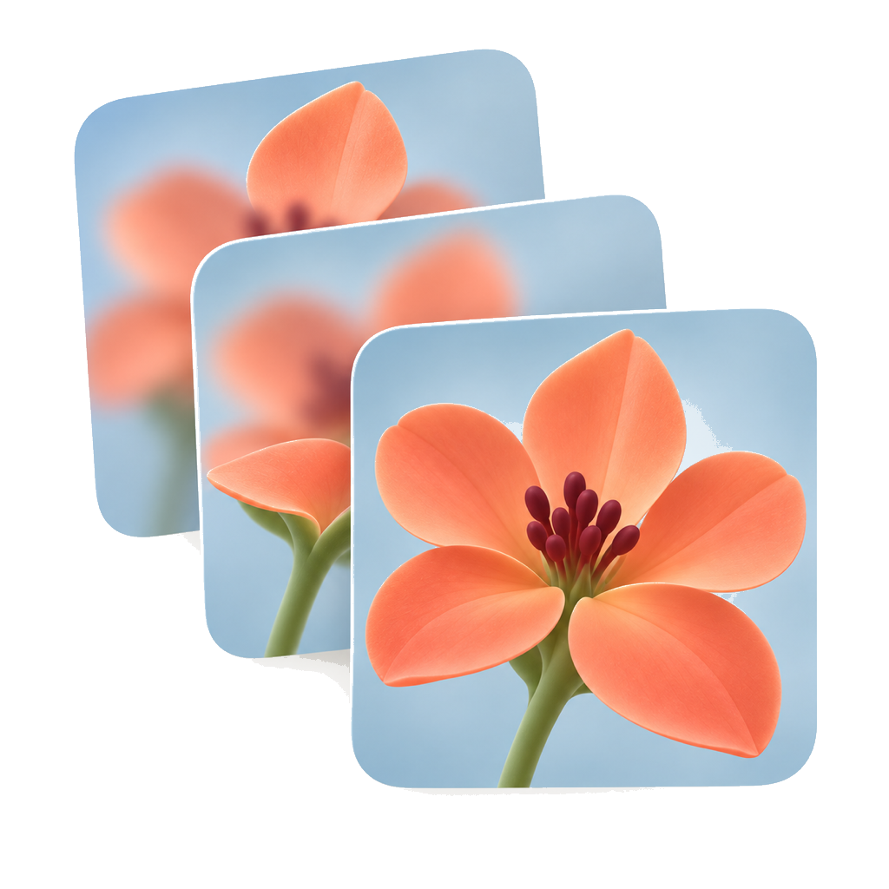
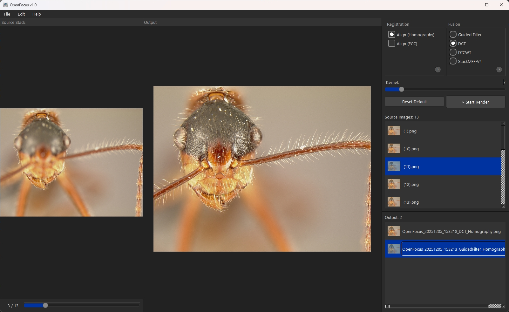

#  OpenFocus

OpenFocus delivers focus stacking quality that rivals commercial-grade software, while staying fully open source and easy to extend.

<p align="left">
  <a href="https://www.python.org/downloads/release/python-3100/"></a>
  <a href="./LICENSE"></a>
  <a href="https://github.com/Xinzhe99/OpenFocus"></a>
  <a href="https://github.com/Xinzhe99/OpenFocus/releases"></a>
  <a href="https://doi.org/10.5281/zenodo.23050823"></a>
</p>

## 📢 News

> [!NOTE]
> 🎉 **2026.09.30**: **v1.32** — deep stacks no longer crash the AI fusion with **out-of-memory**: tiling now engages on total stack size and the AI path adapts its tile/batch size to stack depth. Ships with a soak-test harness and a measured [performance reference](./docs/PERFORMANCE.md).

> 🎉 **2026.09.30**: **v1.28–v1.31** — **pip install openfocus** ([PyPI](https://pypi.org/project/openfocus/)), **publication-grade scale bars** (µm/px auto-detected from ImageJ/OME-TIFF metadata, burned into every export), **multi-page TIFF** Z-stack input/output, **crash auto-recovery**, citable releases (Zenodo DOIs) — plus 30+ code-review fixes, most notably ECC registration composing its transforms in reversed order.

> 🎉 **2026.09.29**: **v1.27** — **16-bit stacks no longer fuse to a black/blown-out image**, in-app **Update and Restart** works again, tall/wide stacks stop crashing tiled fusion, and a dozen smaller fixes (cancellation, batch, projects, themes). **v1.26** fixed the "I/O operation on closed file" render crash in windowed builds ([#4](https://github.com/Xinzhe99/OpenFocus/issues/4)).

> 🎉 **2026.09.28**: **v1.21–v1.25** — portable mode, one-click in-app self-update, EXIF preservation, HEIC input, project files (.ofproj), built-in demo stack, sharpness curve, Japanese/Spanish interfaces.

**Earlier milestones**: v1.9–v1.20 — Wipe compare view, dark/light themes, compare-all-methods, quick preview, cancellable renders, 16-bit pipeline, registration cache, batch CLI, installer/DMG, CI automation. Full history in the [Changelog](./CHANGELOG.md).

<a id="download"></a>
## ⬇️ Download & Install

No setup needed — grab a build from the [Releases](https://github.com/Xinzhe99/OpenFocus/releases) page:

| Platform | File | Type |
|----------|------|------|
| Windows 10/11 (64-bit) | `OpenFocus-*-setup.exe` | **Installer** (recommended) |
| Windows 10/11 (64-bit) | `OpenFocus-*-windows-x64.zip` | Portable (unzip and run) |
| macOS Apple Silicon (M1–M4) | `OpenFocus-*-macos.dmg` | Disk image (drag to Applications) |
| macOS Apple Silicon (M1–M4) | `OpenFocus-*-macos-arm64.zip` | Portable (unzip) |

The app is unsigned, so the first launch may show a security prompt:
- **Windows**: SmartScreen → "More info" → "Run anyway". The first start may take 30–60 s.
- **macOS**: right-click → Open, or run `xattr -cr /Applications/OpenFocus.app` in Terminal.

Full details, including the portable mode and the log folder, are in the [User Manual](./docs/USER_MANUAL_EN.md).

<a id="command-line-usage"></a>
## 💻 Command Line Usage
Beyond the GUI, OpenFocus ships as a pip-installable CLI on [PyPI](https://pypi.org/project/openfocus/) — Windows, macOS and Linux, no Python GUI stack required:
```bash
pip install openfocus          # classical algorithms (guided filter, DCT, DTCWT, GFG-FGF)
pip install "openfocus[ai]"    # + the AI (StackMFF-V4) model, weights included
openfocus --input ./stack_folder --output ./result/fused.png
```
Examples:
```bash
# Fuse a folder of images with guided filter, no registration
openfocus -i ./stack_folder -o ./result/fused.png

# DTCWT with ECC registration, 8 threads
openfocus -i ./stack_folder -o ./result/fused.png -m dtcwt -a ecc -t 8

# AI fusion forced to CPU with a custom tile size
openfocus -i ./stack_folder -o ./result/fused.png -m stackmffv4 --cpu --tile-size 512

# Explicit file list instead of a folder; video files also work as input
openfocus -i img1.jpg img2.jpg img3.jpg -o fused.png -m gfgfgf

# Batch mode: fuse every folder into one output directory
openfocus --input ./stackA ./stackB --output-dir ./results
```
Exit codes: `0` success, `1` processing error, `2` usage error. Run `openfocus --help` for all options. From a source checkout, the same interface works as `python main.py …`.

## 📖 Documentation
- [**User Manual (English)**](./docs/USER_MANUAL_EN.md) — full feature guide: interface, workflows, wipe compare, settings, batch, CLI, troubleshooting
- [**用户手册（中文）**](./docs/USER_MANUAL_ZH.md) — 完整中文功能手册
- [**Changelog**](./CHANGELOG.md) — release history and notable changes
- [**Performance \& Large Stacks**](./docs/PERFORMANCE.md) — soak-test throughput/memory reference and tuning guidance
- [**Build Commands**](./docs/BUILD_COMMANDS.md) — packaging from source with PyInstaller

<a id="building-from-source"></a>
## 🛠️ Building from Source

For contributors and platforms without pre-built packages:
```bash
conda create -n openfocus python=3.10
conda activate openfocus
pip install -r requirements.txt
python main.py
```
Packaging with PyInstaller: see [docs/BUILD_COMMANDS.md](./docs/BUILD_COMMANDS.md).

## Table of Contents
- [⬇️ Download & Install](#download)
- [💻 Command Line Usage](#command-line-usage)
- [📖 Documentation](#documentation)
- [🛠️ Building from Source](#building-from-source)
- [🔭 Overview](#overview)
- [✨ Highlights](#highlights)
- [🧪 Algorithms](#algorithms)
- [📚 References](#references)
- [🤝 Contribution](#contribution)
- [📚 Citing OpenFocus](#citation)
- [📄 License](#license)
- [⭐ Star History](#star-history)

<a id="overview"></a>
## 🔭 Overview
OpenFocus is a PyQt6-based multi-focus registration and fusion workstation that delivers commercial-grade alignment and blending results. The project is fully open source (MIT License) and runs on CPU by default with optional GPU acceleration for the StackMFF V4 neural model.

<p align="center">
	
</p>

<a id="highlights"></a>
## ✨ Highlights
- **Beginner-Friendly**: Plug-and-play workflows with unapologetically simple, guided operations.
- **Flexible Processing Flows**: Run fusion-only, registration-only, or combined registration + fusion pipelines depending on your workload.
- **Wipe Compare View**: Overlay any source frame and any result in one frame with a draggable divider and shared zoom — spot alignment errors at a glance.
- **Batch Automation**: Kick off batch jobs across multiple folders with live progress, cancellation, and automatic output organization.
- **Headless CLI**: Full pipeline from the command line with script-friendly exit codes.
- **Annotation & Export Toolkit**: Overlay labels, export GIF animations, drag results straight out of the app, and save stacks in JPG/PNG/BMP/TIFF.
- **AI-Assisted Fusion**: Ship with StackMFF V4 to unlock deep-learning-quality fusion alongside classic signal-processing methods.
- **Remembers You**: Settings, language, GPU preference and recently opened stacks persist across sessions; bilingual UI throughout.

<a id="fusion--registration-methods"></a>
## 🧪 Algorithms
### Fusion Algorithms

- **Guided Filter**: Fast edge-preserving fusion that enhances contrast while suppressing noise.
- **DCT Multi-Focus Fusion**: Frequency-domain technique optimized for crisp detail recovery.
- **Dual-Tree Complex Wavelet Transform (DTCWT)**: Multi-scale representation that preserves fine texture structures.
- **GFG-FGF**: GFG-FGF is based on a generalized four-neighborhood Gaussian gradient (GFG) operator combined with a fast guided filter (FGF). 
- **StackMFF V4**: Pretrained deep model delivering state-of-the-art focus stacking quality.

### Registration Algorithms
- **Homography**: Performs feature-based projective alignment using keypoint matching and RANSAC to handle global perspective transformations.
- **ECC**: Performs intensity-based alignment by maximizing the enhanced correlation coefficient for precise, sub-pixel registration.
  
> **License Notice:** Every fusion/registration algorithm included comes from open-source research implementations. When using or redistributing them, please follow each algorithm’s original license terms in addition to the OpenFocus MIT license.

<a id="references"></a>
## 📚 References
- M. B. A. Haghighat, A. Aghagolzadeh, and H. Seyedarabi, "Multi-focus image fusion for visual sensor networks in DCT domain," *Computers & Electrical Engineering*, vol. 37, no. 5, pp. 789-797, 2011.
- J. J. Lewis, R. J. O'Callaghan, S. G. Nikolov, D. R. Bull, and N. Canagarajah, "Pixel- and region-based image fusion with complex wavelets," *Information Fusion*, vol. 8, no. 2, pp. 119-130, 2007.
- S. Li, X. Kang, and J. Hu, "Image fusion with guided filtering," *IEEE Transactions on Image Processing*, vol. 22, no. 7, pp. 2864-2875, 2013.
- 付宏语, 巩岩, 汪路涵, 等. 多聚焦显微图像融合算法[J]. Laser & Optoelectronics Progress, 2024, 61(6): 0618022-0618022-9.

<a id="contribution"></a>
## 🤝 Contribution
We welcome community contributions of all kinds:
1. **Issues**: Report bugs, request features, or propose UX enhancements.
2. **Algorithm & Performance Work**: Share new fusion/registration ideas, optimizations.

> Bug reports or suggestions? Please open an issue so we can follow up quickly.

<a id="citation"></a>
## 📚 Citing OpenFocus

If OpenFocus contributes to your research or work, please cite it — it makes the project visible to others who need it:

```bibtex
@software{xie_openfocus,
  author  = {Xie, Xinzhe},
  title   = {{OpenFocus}: An Open-Source Multi-Focus Image Fusion Workstation},
  year    = {2026},
  url     = {https://github.com/Xinzhe99/OpenFocus},
  doi     = {10.5281/zenodo.23050823},
  license = {MIT}
}
```

The repository's **About** sidebar has a *Cite this repository* button (generated from [CITATION.cff](./CITATION.cff)). Every release is archived on Zenodo with a versioned DOI — the DOI above always resolves to the latest release; [cite the specific version DOI](https://zenodo.org/doi/10.5281/zenodo.23050823) when your work depends on a particular one.

If you publish images created with OpenFocus, a note such as *"Created with OpenFocus – https://github.com/Xinzhe99/OpenFocus"* is appreciated (not required).

<a id="license"></a>

## 📄 License
This project is released under the [MIT License](./LICENSE). Feel free to use, modify, and distribute within the terms of the license.

If you publish images created with OpenFocus, please consider adding a note such as:

Created with OpenFocus – https://github.com/Xinzhe99/OpenFocus

This is not mandatory, but highly appreciated.

<p align="center" style="font-size:1.25rem; font-weight:600;">
  If OpenFocus helps you, please consider leaving a ⭐ on the repository!
</p>

<a id="star-history"></a>
## ⭐ Star History

[](https://star-history.com/#Xinzhe99/OpenFocus&Date)


